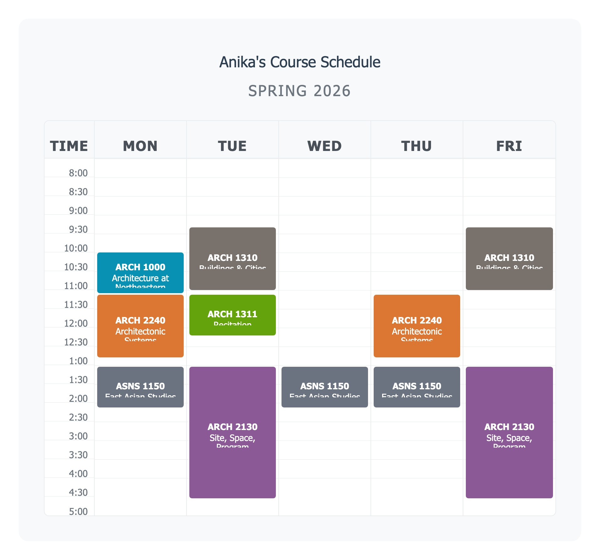

# Fiat Lux

*"Let there be light"* — the motto of UC Berkeley

A visual document summarizer that sheds light on information that's otherwise hard to see. Upload documents and get interactive, AI-generated visualizations you can refine through natural conversation.

<table>
<tr>
<td valign="top" width="40%">

**Input** — raw text copied from a university portal

```
ASNS 1150
East Asian Studies
Snell Engineering Center 108
Mon, Wed, Thu: 1:35 pm - 2:40 pm

ARCH 1310
Buildings and Cities, A Global History
Richards Hall 300
Tue, Fri: 9:50 am - 11:30 am

ARCH 2240
Architectonic Systems
Ryder Hall 215
Mon, Thu: 11:45 am - 1:25 pm

ARCH 2130
Site, Space, Program
Architecture Studio 100
Tue, Fri: 1:35 pm - 5:05 pm
```

</td>
<td valign="top" width="60%">

**Output** — interactive weekly calendar



</td>
</tr>
</table>

→ [More examples](docs/examples.md)

## Features

| Feature | Supported |
|---|---|
| **Upload formats** — PDF, Word, Excel, CSV, images, text | ✅ |
| **Multi-file datasets** — combine files into one document | ✅ |
| **AI extraction** — Claude parses and classifies documents | ✅ |
| **Chat-driven visualization** — generate and refine via conversation | ✅ |
| **Drag-drop new data** — drop files onto the view to update | ✅ |
| **Duplicate project** — reuse a layout with a fresh dataset | ✅ |
| **Export CSV** — extract tables from any visualization | ✅ |
| **Export HTML / PDF / Python** — multiple download formats | ✅ |
| **Save individual charts** — hover to save canvas/SVG as JPEG | ✅ |
| **Link sharing** — shareable public URL, no login required | ✅ |
| **User sharing** — share with another account, view or edit access | ✅ |
| **Stop/abort** — cancel in-flight AI requests (Esc or Stop button) | ✅ |
| **Persistent state** — chat history and visualizations cached in DB | ✅ |

## Getting Started

### Prerequisites

- Python 3.11+
- An Anthropic API key

### Installation

```bash
cd webapp
python -m venv .venv
.venv/bin/pip install -r requirements.txt
```

### Configuration

Create `webapp/.env`:

```
SECRET_KEY=your-secret-key
ANTHROPIC_API_KEY=your-api-key
DATA_DIR=/tmp/fiat-lux-dev
PORT=5001
```

### Running

```bash
cd webapp
.venv/bin/python app.py
```

Open [http://localhost:5001](http://localhost:5001)

## Usage

1. **Import files** — drag and drop or click to upload (multiple files become one dataset)
2. **View the visualization** — AI generates an initial view based on document type
3. **Refine with chat** — describe changes:
   - *"Make it more colorful"*
   - *"Show as a timeline"*
   - *"Highlight the totals"*
4. **Add more data** — drag additional files onto the visualization
5. **Duplicate** — copy a document to reuse its layout with a new dataset
6. **Export** — download as CSV, HTML, PDF, or Python code

## Tech Stack

- **Flask** + SQLite (Python 3.11)
- **Vanilla JS** + Tailwind CSS
- **Claude API** (Anthropic) — document extraction, classification, visualization generation
- **fiat-lux-agents** package — DocumentBot, FilterBot, ChatBot — [how it's used →](docs/agents.md)

## Project Structure

```
fiat-lux/
├── webapp/                  # Flask application
│   ├── app.py               # App factory, blueprint registration
│   ├── auth.py              # Auth helpers (bcrypt, sessions)
│   ├── auth_routes.py       # /login  /register  /logout
│   ├── main_routes.py       # /  /dashboard  /about
│   ├── file_routes.py       # /api/files/*  (upload, rename, delete, duplicate)
│   ├── view_routes.py       # /view/<id>  /api/chat/<id>
│   ├── share_routes.py      # /api/shares/*  /shared/<token>
│   ├── extractor.py         # Document extraction via Claude
│   ├── db.py                # SQLite helpers, schema init
│   ├── templates/           # Jinja2 HTML templates
│   └── static/              # CSS + JS (vanilla, no framework)
│       ├── js/dashboard.js
│       ├── js/view.js
│       └── js/share.js
└── data/                    # SQLite DB + user file storage
    ├── fiat-lux.db
    └── users/{id}/imports/
```

## Node.js → Flask Migration

The original app was built in Next.js (`visualizer/`). It has been fully replaced by the Flask app. See [issue #30](https://github.com/aabtzu/fiat-lux/issues/30) for the complete feature parity table.

Flask adds features not in the original Node version:
- Duplicate project (reuse layout with new data)
- Export Python code
- Stale-data banner on fresh duplicates

## License

MIT
